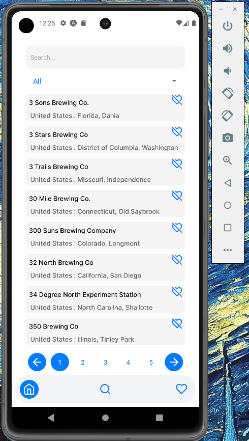
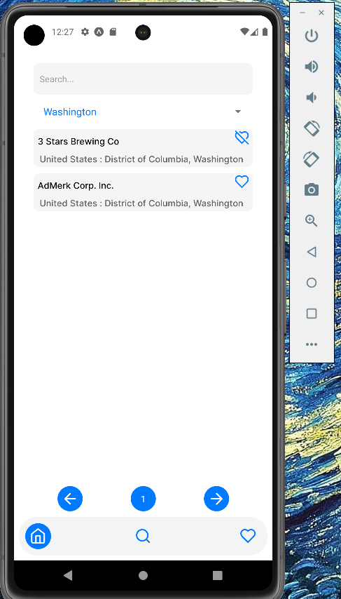
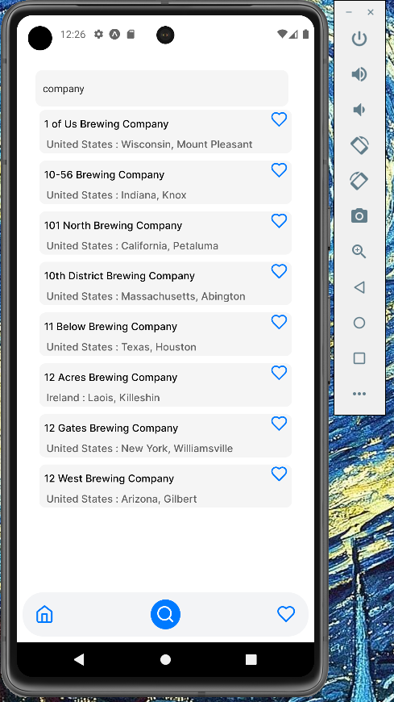
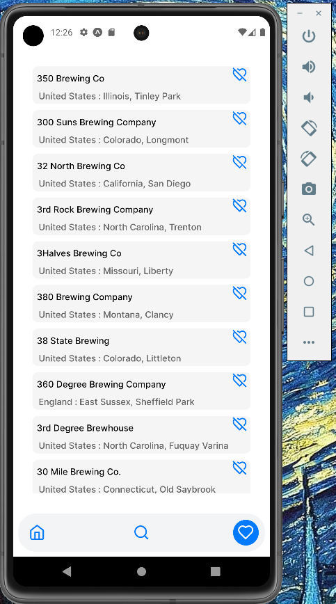

# Zest Challenge - Aplicación de Listado de Cervecerías

Esta es una aplicación móvil desarrollada como parte del Zest React Native Challenge. Permite a los usuarios explorar, filtrar y ver detalles de cervecerías de distintas ciudades alrededor del mundo.

## Capturas de Pantalla

¡A continuación, se muestran algunas capturas de pantalla de la aplicación!

## Funcionalidades

- **Listado de Cervecerías:** Visualiza una lista de cervecerías provenientes de distintas ciudades del mundo.
- **Listado de Likes:** Visualiza una lista de cervecerías provenientes de distintas ciudades del mundo.
- **Filtrado por Nombre:** Busca cervecerías por su nombre para encontrar rápidamente la que estás buscando.
- **Detalle de Cerveza:** Accede a detalles adicionales de una cervecería para conocer más sobre ella.

## Tecnologías Utilizadas

- **React Native:** Framework utilizado para el desarrollo de la aplicación.
- **Expo:** Herramienta que facilita el desarrollo y la implementación de aplicaciones React Native.
- **Librerías de UI:** Tamagui.
- **Gestión de Estado:** Context API, AsyncStorage.
- **Navegación:** Expo Router.
- **Consumo de API:** Axios.

## Instrucciones de Ejecución Local

1. **Clonar el Repositorio:** `git clone https://github.com/Jwilv/zest-challenge `
2. **Instalar Dependencias:** `npm install`
3. **Ejecutar la Aplicación:** `npm start`

## Contribución

¡Este proyecto está abierto a contribuciones! Si deseas mejorar la aplicación o añadir nuevas características, no dudes en hacer un fork del repositorio y enviar un pull request con tus cambios.

## Notas

- Este proyecto fue desarrollado como parte del Zest React Native Challenge y está destinado únicamente para propósitos de evaluación.
